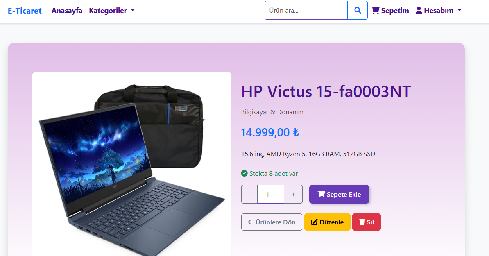
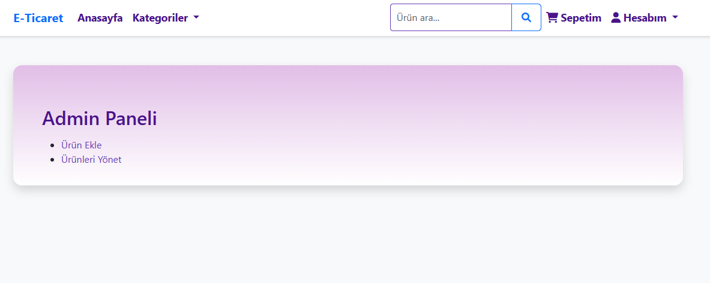

 🛒 AkilliTech E-Commerce

Modern ve kullanıcı dostu bir E-Ticaret web uygulamasıdır.  
ASP.NET Core MVC (.NET 9) kullanılarak geliştirilmiştir.

 🚀 Kullanılan Teknolojiler

- ASP.NET Core MVC (.NET 9)
- Entity Framework Core 9
- SQL Server
- BCrypt.Net (Şifre Hashleme)
- Bootstrap 5
- Session Management
- Code First Migration

 👤 Özellikler

 🧑‍💻 Kullanıcı İşlemleri

- Kayıt Ol / Giriş Yap
- Ürün Listeleme
- Ürün Detay Görüntüleme
- Sepete Ürün Ekleme
- Sepet Güncelleme
- Sipariş Oluşturma
- Ödeme Simülasyonu
- Sipariş Geçmişi Görüntüleme

🛠 Admin Paneli

- Ürün Ekleme / Güncelleme / Silme
- Kategori Yönetimi
- Siparişleri Görüntüleme
- Admin Rol Kontrolü
- Stok Yönetimi


 🔐 Güvenlik Özellikleri

- BCrypt ile şifrelerin hashlenmesi
- AntiForgeryToken kullanımı
- Session tabanlı yetkilendirme
- Admin kontrol mekanizması
- Form doğrulama kontrolleri


 🗄️ Veritabanı

- SQL Server
- Entity Framework Core (Code First)
- Migration yapısı
- Seed Data ile otomatik admin oluşturma

 Varsayılan Admin Bilgileri

- **Email:** admin@example.com  
- **Şifre:** Admin123!


 ⚙️ Kurulum Adımları

 1️⃣ Repository Klonlama

```bash
git clone https://github.com/havvayeni1138/AkilliTech-ECommerce.git
```

 2️⃣ Veritabanı Bağlantısını Düzenleme

`appsettings.json` dosyasındaki connection string'i kendi SQL Server bilgilerinize göre güncelleyin.

3️⃣ Migration Uygulama

Package Manager Console üzerinden:

```bash
Update-Database
```

veya CLI ile:

```bash
dotnet ef database update
```
 4️⃣ Projeyi Çalıştırma

```bash
dotnet run
```


 🧠 Teknik Detay

Bu projede hazır ASP.NET Identity sistemi yerine custom authentication yapısı geliştirilmiştir.  
Kullanıcı doğrulama ve rol kontrolü manuel olarak tasarlanmıştır.  
Şifreler BCrypt algoritması ile güvenli şekilde hashlenerek veritabanında saklanmaktadır.


📌 Mimari Yapı

- MVC (Model-View-Controller) Pattern
- Katmanlı proje yapısı
- Entity Framework ORM
- Session tabanlı Authentication sistemi
- Seed Data ile başlangıç veri yönetimi


📸 Ekran Görüntüleri

> 



 👨‍💻 Geliştirici

Bu proje bireysel geliştirme ve portföy çalışması kapsamında hazırlanmıştır.
